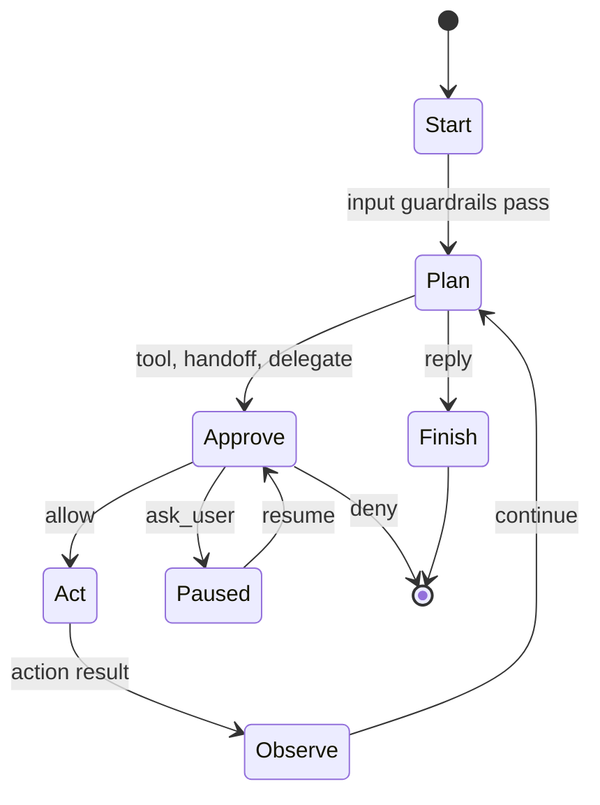

# Agent OS Design

Agent OS is built around one typed run loop. The loop owns all transitions between planning, approval, action, observation, pause, and finish states. Extensions can implement public interfaces, but the core engine owns the safety-critical control flow.

## Layering

```text
extensions/      Optional implementations of public interfaces.
workspace/       Agent-owned configuration, memory, tools, and skills.
crates/          Immutable runtime core and public APIs.
```

`agentos-core` must not depend on `workspace/` or `extensions/`. Types that need to cross this boundary belong in `agentos-interfaces` or `agentos-proto`.

## Run Loop



`RunLoopState::step()` consumes the current state and returns the next state. Invalid transitions are not represented by the public API.

## Gateway

The gateway has two layers. `Gateway` remains a bounded `mpsc` ingress queue for cron tasks and other producers that already have an `Envelope`. `GatewayService` sits above that queue and drives channel-facing work: receive an inbound envelope from a `Channel`, run it through the runner, send the final reply back through the same channel, and send approval prompts for paused runs. This keeps channel adapters thin and keeps LLM-backed or deterministic orchestrators behind the same runner boundary.

## Safety Rings

1. Type system: `RunLoopState`, `Plan`, and `PolicyDecision` encode state and action choices explicitly.
2. Guardrails: input, tool, and output checks inspect content and halt with typed errors.
3. Approve: every boundary action receives an allow, deny, or ask-user decision from the concrete policy engine.
4. Isolation: policy-marked actions can run out of process or in a sandbox.

## Phase 0 Status

This scaffold establishes the workspace, proto wire types, interface traits, test-support mocks, bounded gateway, concrete approve placeholders, and a minimal `Start -> Plan -> Finish` path for integration testing.
