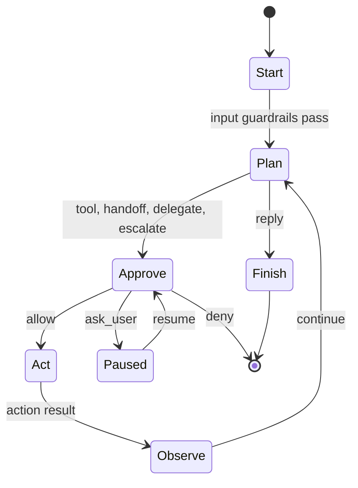

# Agent OS Design

Agent OS is built around one typed run loop. The loop owns all transitions between planning, approval, action, observation, pause, and finish states. Extensions can implement public interfaces, but the core engine owns the safety-critical control flow.

This document is the condensed loop-and-safety reference. See [`docs/ARCHITECTURE.md`](docs/ARCHITECTURE.md) for the full architecture, memory model, and extension boundary.

## Layering

```text
extensions/      Optional implementations of public interfaces.
workspace/       Agent-owned configuration, memory, tools, and skills.
crates/          Immutable runtime core and public APIs.
```

`agentos-core` must not depend on `workspace/` or `extensions/`. Types that need to cross this boundary belong in `agentos-interfaces` or `agentos-proto`. Workspace-owned content is loaded as data through config, never linked as a dependency. The boundary is enforced by `scripts/check-import-boundaries.sh`.

## Run Loop



`RunLoopState::step()` consumes the current state and returns the next state. The state enum is `Start`, `Plan`, `Approve`, `Act`, `Observe`, `Paused`, `Finish`. Invalid transitions are not represented by the public API.

Plan variants:

- `Reply`: terminal assistant output.
- `CallTool`: execute a local or MCP-backed tool.
- `Handoff`: switch the active agent and continue planning.
- `Delegate`: run a sub-agent and return its result to the parent.
- `Escalate`: run a configured sub-orchestrator template.

Guardrail and approval placement:

- Input guardrails run in `Start`; tool guardrails run in `Act`; output guardrails run before a terminal reply finishes.
- Every non-terminal action crosses `Approve`. `allow` proceeds to `Act`, `deny` terminates with a policy error, and `ask_user` serializes a paused `RunState` for later resume.
- Sub-agent permissions can only narrow the parent's; every sub-agent tool call re-enters the loop at `Approve`.

## Gateway

The gateway has two layers. `Gateway` remains a bounded `mpsc` ingress queue for cron tasks and other producers that already have an `Envelope`. `GatewayService` sits above that queue and drives channel-facing work: receive an inbound envelope from a `Channel`, run it through the runner, send the final reply back through the same channel, and send approval prompts for paused runs. This keeps channel adapters thin and keeps LLM-backed or deterministic orchestrators behind the same runner boundary.

## Safety Rings

1. Type system: `RunLoopState`, `Plan`, and `PolicyDecision` encode state and action choices explicitly.
2. Guardrails: input, tool, and output checks inspect content and halt with typed errors.
3. Approve: every boundary action receives an allow, deny, or ask-user decision from the concrete policy engine. `Approve` is concrete, not an extension trait.
4. Isolation: tools marked `requires_isolation` run through a subprocess worker.

## Status

The scaffold milestone is complete. The active baseline includes the typed loop and trace shape, concrete approval with serializable paused runs, reference tools and guardrails, SQLite session and scoped memory storage with hydration and reflection, Telegram and Feishu reference channels, configured sub-agents and sub-orchestrator templates, static and stdio MCP registration, subprocess isolation for marked tools, and runtime path injection with an enforced extension boundary. Remaining architecture work and open decisions are tracked in [`docs/ARCHITECTURE.md`](docs/ARCHITECTURE.md) and [`docs/PLAN.md`](docs/PLAN.md).
